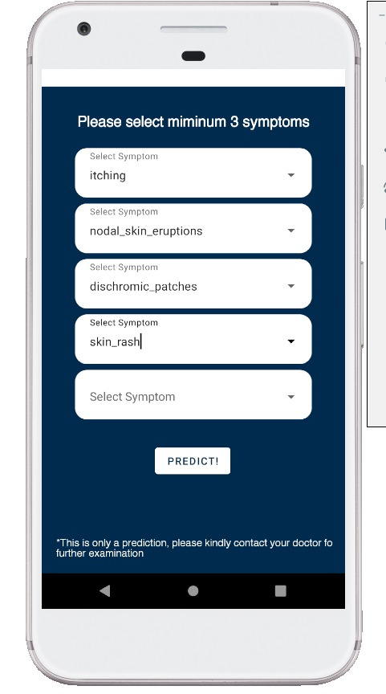

<!--
*** WELCOME TO HIPOTESA PROJECT
*** Thanks for checking out the Hipotesa Project Readme. If you have a suggestion
*** that would make this better, please fork the repo and create a pull request
*** or simply open an issue with the tag "enhancement".
*** Thanks again! Now go create something AMAZING! :D
-->

<!-- COLOR CODE: 082c4e -->

<p align="center">
    
</p>

<!-- PROJECT LOGO -->
<br />
<p align="center">
  <a href="http://www.hipotesa.tech/">
    
  </a>

  <h3 align="center">Hipotesa Application</h3>

  <p align="center">
    An AI based healthcare system aims to help patients to detect their disease at an early stage to be able to identify the treatment plan early on and help them secure a good way to live.
    <br />
    <a href="https://github.com/ravedya/HipotesaApplication#readme"><strong>Go to the project »</strong></a>
    <br />
    <br />
    <a href="https://github.com/ravedya/HipotesaApplication/">View Demo</a>
    ·
    <a href="http://www.hipotesa.tech/">Our Website</a>
    ·
    <a href="https://github.com/ravedya/HipotesaApplication/#contributing">Contribute</a>
    ·
     <a href="https://github.com/ravedya/HipotesaApplication/issues">Report Bug</a>
  </p>
</p>

<!-- TABLE OF CONTENTS -->
<details open="open">
  <summary><h2 style="display: inline-block">Table of Contents</h2></summary>
  <ol>
    <li>
      <a href="#about-the-project">About The Project</a>
      <ul>
        <li><a href="#built-tools">Built Tools</a></li>
      </ul>
    </li>
    <li>
      <a href="#getting-started">Getting Started</a>
      <ul>
        <li><a href="#prerequisites">Prerequisites</a></li>
        <li><a href="#device-requirements">Device Requirements</a></li>
        <li><a href="#installation">Installation</a></li>
      </ul>
    </li>
    <li><a href="#results">Results</a></li>
    <li><a href="#other-repositories">Other Repositories</a></li>
    <li><a href="#our-mobile-development-team">Our Mobile Development Team</a></li>
    <li><a href="#contributing">Contributing</a></li>
    <li><a href="#license">License</a></li>
    <li><a href="#acknowledgements">Acknowledgements</a></li>
    <li><a href="#copyright">Copyright</a></li>
  </ol>
</details>

<!-- ABOUT THE PROJECT -->

## About The Project

There are a lot of diseases that you need to detect at an early stage to be able to identify the treatment plan early on and help the patient secure a good way to live. An early detection of disease and a precise diagnosis allows for quicker action, saving precious time, and to prevent complications and rapid worsening. Health practitioners have conducted surveys and collected data on patient information, their disease, and symptoms that allow them to distinguish the patient's disease with common symptoms. Therefore, the data set can be used to train the model that can predict the disease based on the symptoms.

In this project we create an **Android Native Mobile Application** with the resources are supported by **Google Cloud Platform**. We imlemented a **Machine Learning Model** that requires data containing a list of symptoms. Our system then will find out what disease the patients have and what treatments they should take.

<!-- RESOURCES -->

### Built Tools

- [Android Studio](https://developer.android.com/studio)
- [Kotlin](https://kotlinlang.org/)
- [Retrofit](https://square.github.io/retrofit/)
- [Glide](https://www.tensorflow.org/decision_forests)
- [Jetpack](https://developer.android.com/jetpack)

<!-- GETTING STARTED -->

## Getting Started

This is an overview of Hipotesa Application, what the prequisites are, how the Android application works, data visualization, model testing, and more.

### Prerequisites

- Android Studio 4.2.1

### Device Requirements

- Android 5.0 (Lolipop) API 21

### Installation

We recommend you to install it on Android devices or Android emulators with the device as mentioned above.

1. Download the APK file
   ```sh
   $ git clone https://github.com/davindb/Hipotesa.git
   ```
2. Install the APK file into Android devices or Android Emulator
   ```sh
   hipotesa.apk
   ```

## Results

The application have four activity inside including splash screen, home activity, main activity, and the prediction result activity. Below are shown activity in order.

<p align="center" style="padding-top: 5px">
  <a href="#images/open.jpeg">
    
  </a>
  &nbsp;&nbsp;&nbsp;&nbsp;&nbsp;&nbsp;
  <a href="#images/menu.jpeg">
    
  </a>
   &nbsp;&nbsp;&nbsp;&nbsp;&nbsp;&nbsp;
  <a href="#images/inputs.jpeg">
    
  </a>
   &nbsp;&nbsp;&nbsp;&nbsp;&nbsp;&nbsp;
   <a href="#images/outputs.jpeg">
    
  </a>
</p>


## Other Repositories

Check our other repositories to know more about Hipotesa.

- [Hipotesa Project](https://github.com/davindb/Hipotesa)
- [Hipotesa Algorithm](https://github.com/davindb/HipotesaAlgorithm)
- [Hipotesa Rest API & Cloud Management](https://github.com/Guscah/HipotesaRestAPI)

<!-- TEAM MEMBERS -->

## Our Mobile Development Team

|            Member             | Student ID |       Project Role        |                                                  Contacts                                                  |
| :---------------------------: | :--------: | :-----------------------: | :--------------------------------------------------------------------------------------------------------: |
| Ravedya Aufa Amaranggana |  A0111155  |Mobile Developer | [![raved-linkedin][linkedin-shield]][raved-linkedin-url][![raved-github][github-shield]][raved-github-url] |
<!-- CONTRIBUTING -->

## Contributing

Contributions are what make the open source community such an amazing place to be learn, inspire, and create. Any contributions you make are **greatly appreciated**.

1. Fork the Project
2. Create your Feature Branch (`git checkout -b feature/AmazingFeature`)
3. Commit your Changes (`git commit -m 'Add some AmazingFeature'`)
4. Push to the Branch (`git push origin feature/AmazingFeature`)
5. Open a Pull Request

<!-- LICENSE -->

## License

Distributed under the MIT License. See `LICENSE` for more information.

<!-- ACKNOWLEDGEMENTS -->

## Acknowledgements

We are very grateful to all of those with whom we have had the pleasure to work during this and other related projects especially [Bangkit Academy](https://grow.google/intl/id_id/bangkit/) who supported for doing this project. Each of the team members of this project has provided the team extensive personal and professional guidance about both scientific research and life in general especially in healthcare related fields.

<p align="center" style="padding-top: 5px">
  <a href="https://grow.google/intl/id_id/bangkit/">
    
  </a>
  &nbsp;&nbsp;&nbsp;&nbsp;&nbsp;&nbsp;
  <a href="http://www.hipotesa.tech/">
    
  </a>
</p>

<!-- COPYRIGHT -->

## Copyright

Kreasi Anak Bangsa group © Copyright 2021 | All Rights Reserved.

<!-- MARKDOWN LINKS & IMAGES -->
<!-- https://www.markdownguide.org/basic-syntax/#reference-style-links -->

<!-- LINKED IN -->

[linkedin-shield]: https://img.shields.io/badge/LinkedIn--blue?style=social&logo=Linkedin
[davin-linkedin-url]: https://www.linkedin.com/in/davindb/
[ihsan-linkedin-url]: https://www.linkedin.com/in/ihsanramdhani/
[agus-linkedin-url]: https://www.linkedin.com/in/aguscahya/
[fadia-linkedin-url]: https://www.linkedin.com/in/fadia-fatta-dylla-326998113/
[raved-linkedin-url]: https://www.linkedin.com/in/ravedya/

<!-- GITHUB -->

[github-shield]: https://img.shields.io/badge/GitHub--blue?style=social&logo=Github
[davin-github-url]: https://github.com/davindb
[ihsan-github-url]: https://github.com/ihsanramdhani
[agus-github-url]: https://github.com/Guscah
[fadia-github-url]: https://github.com/fadiafattadyllaaa
[raved-github-url]: https://github.com/ravedya

<!-- OTHERS -->

[contributors-shield]: https://img.shields.io/github/contributors/davindb/HipotesaAlgorithm.svg?style=for-the-badge
[contributors-url]: https://github.com/davindb/HipotesaAlgorithm/graphs/contributors
[forks-shield]: https://img.shields.io/github/forks/davindb/HipotesaAlgorithm.svg?style=for-the-badge
[forks-url]: https://github.com/davindb/HipotesaAlgorithm/network/members
[stars-shield]: https://img.shields.io/github/stars/davindb/HipotesaAlgorithm.svg?style=for-the-badge
[stars-url]: https://github.com/davindb/HipotesaAlgorithm/stargazers
[issues-shield]: https://img.shields.io/github/issues/davindb/HipotesaAlgorithm.svg?style=for-the-badge
[issues-url]: https://github.com/davindb/HipotesaAlgorithm/issues
